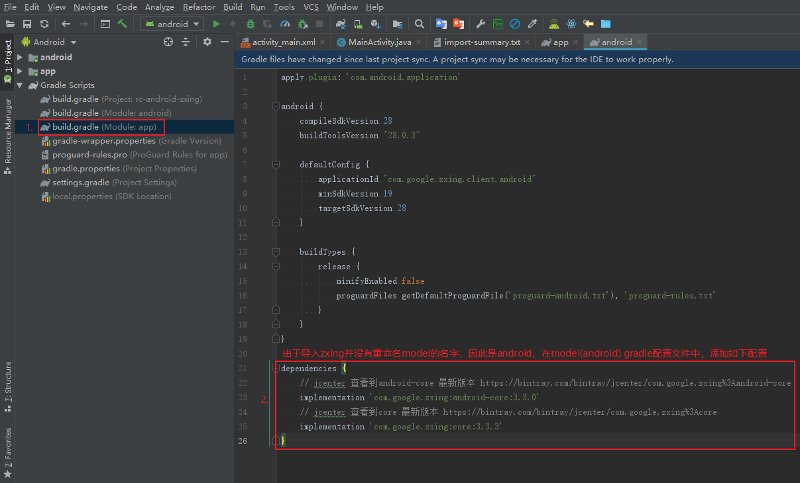

# rc-android-zxing

该分支仅作为源码阅读学习，此分支上做任何修改

## import project

官方项目  


准备工作
* 下载官方项目[zxing](https://github.com/zxing/zxing)
* 使用 AS 创建一个新Project

> 编译环境
>* android studio：3.4
>* gradle：5.1.1
>* sdk：28

导入步骤
* 导入module  
    
* 选择module  
    
* 移除最小及目标版本设置  
    
* 添加项目核心依赖  
    
* 删除 `app` module（可选，该分支已删除）

## show project


## solve problem


运行错误日志  


### 解决方法  
* 打开应用设置，手动设置应用相机权限
* 代码中加入权限校验
```java
// CaptureActivity.jaca
// line 266 && line 443
mHolder = surfaceHolder;
if (Build.VERSION.SDK_INT > Build.VERSION_CODES.LOLLIPOP_MR1) {
    if (ContextCompat.checkSelfPermission(CaptureActivity.this,
           android.Manifest.permission.CAMERA) != PackageManager.PERMISSION_GRANTED) {
        // 先判断有没有权限 ，没有就在这里进行权限的申请
        ActivityCompat.requestPermissions(CaptureActivity.this,
            new String[]{Manifest.permission.CAMERA}, CAMERA_OK);
        } else {
             // 说明已经获取到摄像头权限了
             initCamera(surfaceHolder);
         }
    } else {
        initCamera(surfaceHolder);
}

// line 803
@Override
public void onRequestPermissionsResult(int requestCode
        , @NonNull String[] permissions, @NonNull int[] grantResults) {
    // If request is cancelled, the result arrays are empty.
    if (requestCode == CAMERA_OK) {
        if (grantResults.length > 0
                && grantResults[0] == PackageManager.PERMISSION_GRANTED) {
            // permission was granted, yay! Do the
            // contacts-related task you need to do.
            initCamera(mHolder);
        }
    }
}
```

### 其他问题
* 同样我们在`EncodeActivity.java`文件中加入读取内存卡的权限`READ_EXTERNAL_STORAGE`